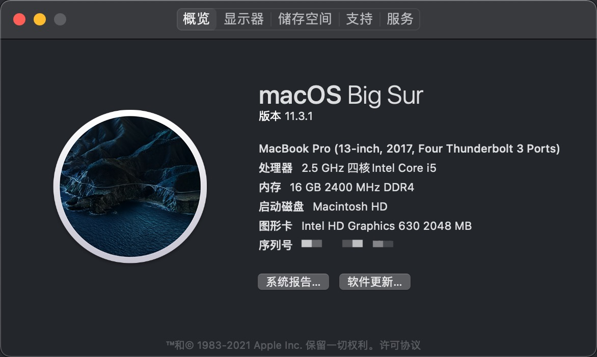

# R720-15IKBN-Hackintosh
## 联想拯救者R720黑苹果 Big Sur

> 10.15版本请查看 [10.15分支](https://github.com/Jonny-china/R720-15IKBN-Hackintosh/tree/10.15)

**当前OC版本0.6.9，可直接使用macOS Big Sur(11.4)正式版，已测试成功版本：**

- macOS Big Sur 11.4
- macOS Big Sur 11.3.1

## 使用本项目说明：

1. 该项目本人是测试成功的，网友使用请自行测试。
2. 由于本人使用的是dw1560网卡，没有使用该网卡的请自行删除/OC/Kexts/目录下的`AirportBrcmFixup.kext`、`BrcmBluetoothInjector.kext`、`BrcmFirmwareData.kext`、`BrcmPatchRAM3.kext`这四个与该网卡有关的驱动，并在 `EFI/OC/config.plist/Kernel/`中关闭内核设置。
3. `MLB`*(主板序列号)*、`SystemSerialNumber`*（序列号）*、`SystemUUID`三码需要自行设置，可使用 Hackintool.App，系统-> 序列号生成器，生成对应的三码。
4. 已加上USB定制，最好自己再定制USB，参考黑果小兵[Hackintool(原Intel FB-Patcher)使用教程及插入姿势](https://blog.daliansky.net/Intel-FB-Patcher-tutorial-and-insertion-pose.html#定制usb)。

### 配置信息

| 名称                    | 参数                                                         |
| ----------------------- | ------------------------------------------------------------ |
| 型号                    | Lenovo Rescuer R720-15IKBN                                   |
| CPU                     | Intel Core i5-7300HQ (Kaby Lake)                             |
| 显卡                    | 核显 HD 630，独显 GTX 1050 Ti                                |
| 无线网卡/蓝牙（已更换） | BCM94352z(DW1560)驱动（自带网卡驱动不了，*真心玩黑苹果的建议买一个，闲鱼200不到，不玩的时候再挂上去*卖） |

### 已经驱动

- 核显HD630(独显暂时无解，已屏蔽)

- 声卡使用Applealc原生驱动，注入Layout ID: 28，完美支持Tpye-C耳机、3.5耳机、外放

- 可调节音量和亮度，小键盘可用（亮度调节，Fn+F11/F12不能使用，没有驱动，使用小键盘的<kbd>4</kbd>和<kbd>-/Pause</kbd>，来控制亮度降低和增加）

- USB3.0/2.0正常使用（3.0支持最高5G/s）

- 支持One Key HIDPI

- 支持HDMI（暂不支持音频）

- 变频ok，支持16档

- 触控板支持设置中的所有手势

- 睡眠正常（定制USB驱动后）

- 无线网卡/蓝牙（已更换 DW1560）

  隔空投送正常，其他没有设备测试

- 摄像头可用

- 安卓USB共享网络（需配合安装 HoRNDIS-9.2.pkg）

### 存在的问题

- 开启HIDPI后，关机和重启时会花屏

### 相关截图

