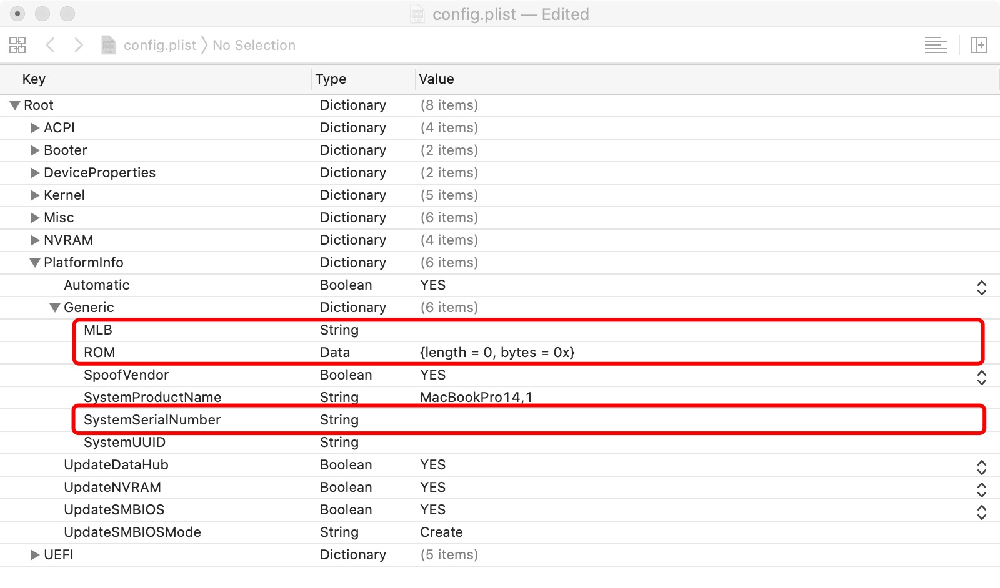
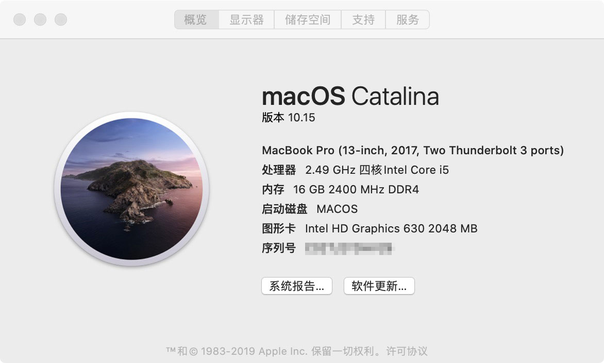
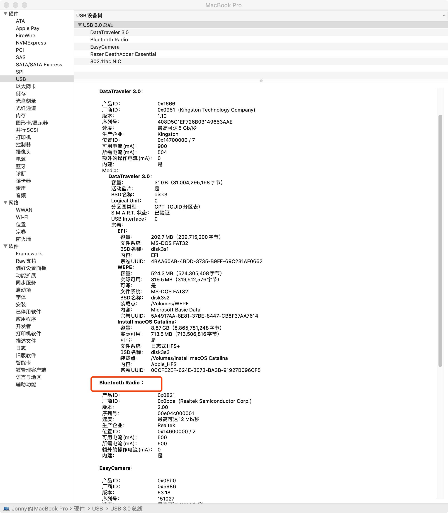
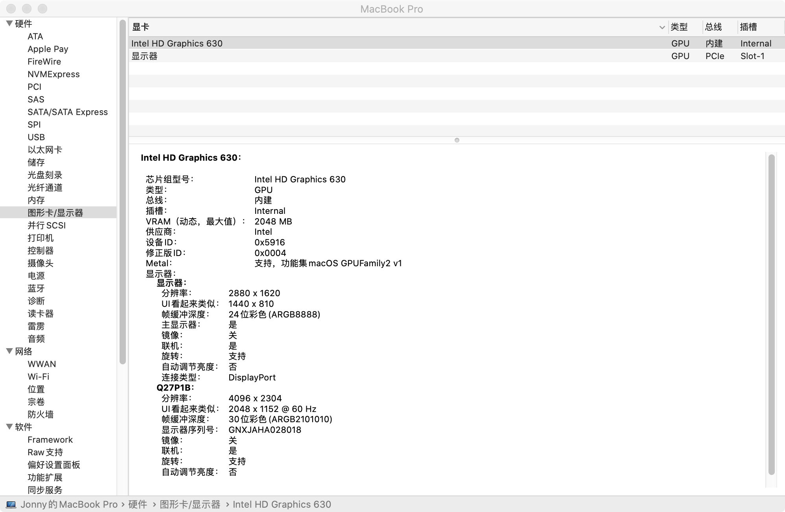
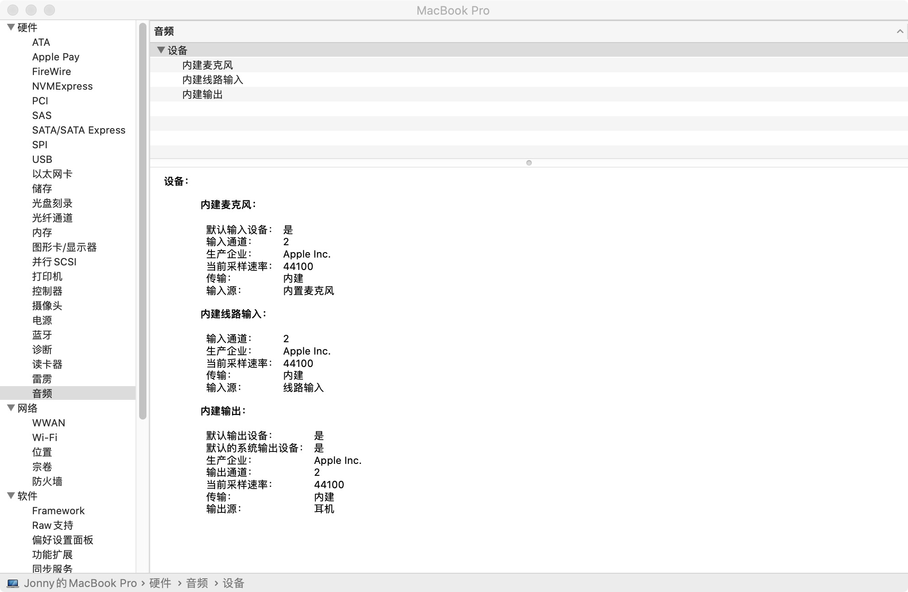
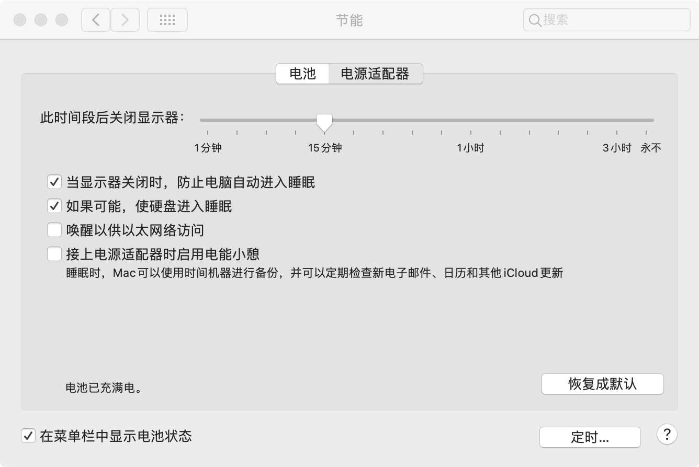
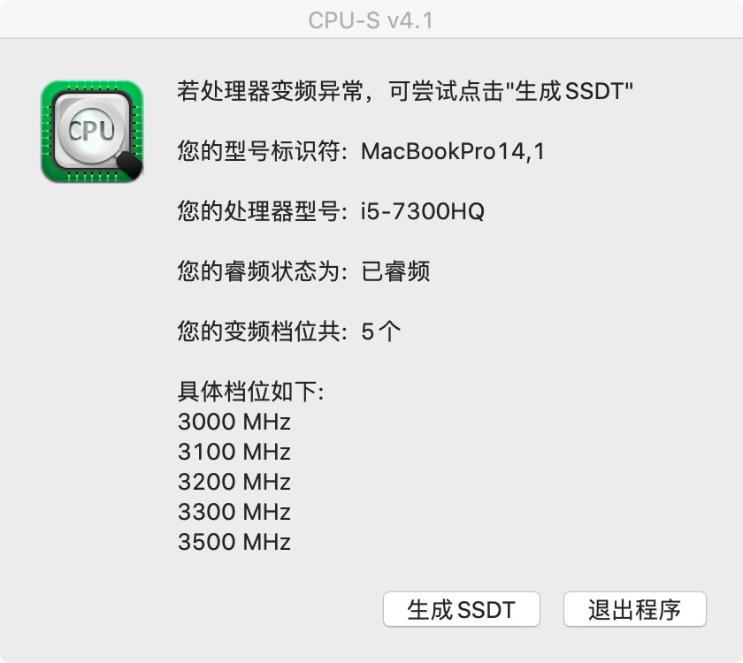

# R720-15IKBN-Hackintosh-EFI
拯救者 R720-15IKBN i5 7300HQ HD630 10.15 OC Clover 双引导

## 联想拯救者R720黑苹果 Catalina
**该Clover引导可直接使用macOS catalina(10.15)正式版**

*这个Clover本人已亲自测试*
* * *
> #### *更新：2019.11.26*
> 更新OpenCore 0.5.3版本
> 升级一些驱动

* * *
> #### *更新：2019.10.24*
> **增加OC启动配置**(具体效果与clover一样，releases里面下载)
> 已入OC坑，Clover暂时不更新（不知道是不是错觉，感觉OC比CLOVER进系统速度快）
> ##### 使用须知
> 自行加入图上的三码，可参考：黑果小兵的 [精解OpenCore](https://blog.daliansky.net/OpenCore-BootLoader.html) `PlatformInfo`那一节
> 
> 
> ##### OC在本机目前存在的问题：
> * 引导windows不行，会蓝屏(*别的机器不知道怎么样，但是本机是蓝屏，进Windows还是按F12吧*)
> * 睡眠还是不行（有没有大佬帮忙解决一下啊）

* * *

> #### *更新：2019.10.21*
> *修复触摸板手势*
> **不能修改键盘的修饰键，不然触摸板大部分手势都失效**
> 单指：双击拖拽，如果不能正常工作需要去勾选 `系统偏好设置` -> `辅助功能` -> `指针控制` -> `触控板选项` -> `启用拖拽`
> 
> 两指：轻点 = 鼠标右键
>
> 三指：
> * 上滑：应用全屏
> * 右滑：切换最新的app
> * 下滑：最小化窗口
> * 左滑：页面切换，如浏览器tab页；对应快捷键 `CTRL + TAB`
>
> 四指：
> * 上滑：调度中心
> * 右滑：向右切换 全屏app
> * 下滑：应用程序窗口（对应触控板设置里的 App Expose）
> * 左滑：向左切换 全屏app
>
> 五指：目前只发现点按 Dashboard操作，但10.15苹果关闭了 dashboard 所以只在浏览器界面点击才能看出效果，能打开浏览器的调试界面

* * *
## 已经驱动
* #### 核显HD630(独显暂时无解，已屏蔽)
* #### 声卡使用Applealc原生驱动，注入Layout ID: 28，完美支持Tpye-C耳机、3.5耳机、外放
* #### 可调节音量和亮度，小键盘可用
* #### USB3.0/2.0正常使用（3.0支持最高5G/S）
* #### 自动识别固态和机械
* #### 支持One Key HIDPI
* #### 支持HDMI
* #### 变频ok
* #### 触控板支持多手势

## 目前存在的问题
* #### 亮度调节可以到 `系统偏好设置` -> `键盘` -> `快捷键` -> `显示器` 设置快捷方式
* #### 蓝牙可使用，但无法关闭，且连接蓝牙音箱时声音可能会卡顿
* #### 睡眠会自动唤醒，可以在节能里关闭睡眠

* * *
*希望有朋友帮忙解决 **睡眠** 问题*
* * *

## 无法驱动
* #### 独显GTX1050Ti。
* #### WIFI无解，需要的可自行更换博通网卡。

## 相关截图

## 下载
[https://github.com/Jonny-china/R720-15IKBN-Hackintosh-Clover/releases](https://github.com/Jonny-china/R720-15IKBN-Hackintosh-Clover/releases)

