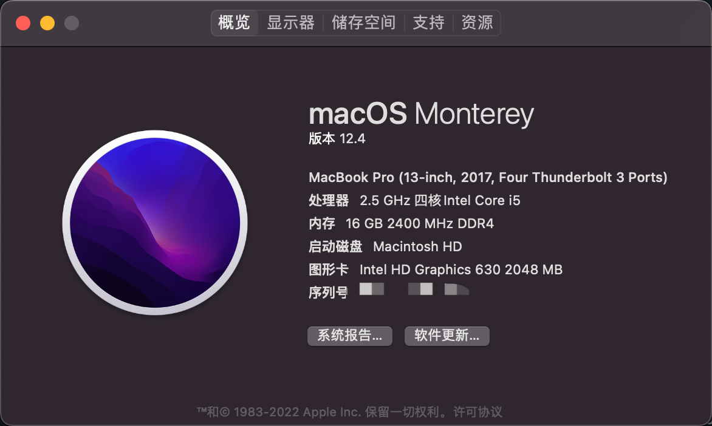

# R720-15IKBN-Hackintosh

## 联想拯救者 R720 黑苹果 Big Sur

> 10.15 版本请查看 [10.15 分支](https://github.com/Jonny-china/R720-15IKBN-Hackintosh/tree/10.15)

**当前 OC 版本 0.7.0，可直接使用 macOS Big Sur(11.5.1)正式版，已测试成功版本：**

- macOS Big Sur 11.5.1
- macOS Big Sur 11.4
- macOS Big Sur 11.3.1

## 使用本项目说明：

1. 该项目本人是测试成功的，网友使用请自行测试。
2. 由于本人使用的是 dw1560 网卡，没有使用该网卡的请自行删除/OC/Kexts/目录下的`AirportBrcmFixup.kext`、`BrcmBluetoothInjector.kext`、`BrcmFirmwareData.kext`、`BrcmPatchRAM3.kext`这四个与该网卡有关的驱动，并在 `EFI/OC/config.plist/Kernel/`中关闭内核设置。
3. `MLB`_(主板序列号)_、`SystemSerialNumber`_（序列号）_、`SystemUUID`三码需要自行设置，可使用 Hackintool.App，系统-> 序列号生成器，生成对应的三码。
4. 已加上 USB 定制，最好自己再定制 USB，参考黑果小兵[Hackintool(原 Intel FB-Patcher)使用教程及插入姿势](https://blog.daliansky.net/Intel-FB-Patcher-tutorial-and-insertion-pose.html#定制usb)。

### 配置信息

| 名称                    | 参数                                                                                                       |
| ----------------------- | ---------------------------------------------------------------------------------------------------------- |
| 型号                    | Lenovo Rescuer R720-15IKBN                                                                                 |
| CPU                     | Intel Core i5-7300HQ (Kaby Lake)                                                                           |
| 显卡                    | 核显 HD 630，独显 GTX 1050 Ti                                                                              |
| 无线网卡/蓝牙（已更换） | BCM94352z(DW1560)驱动（自带网卡驱动不了，*真心玩黑苹果的建议买一个，闲鱼 200 不到，不玩的时候再挂上去*卖） |

### 已经驱动

- 核显 HD630(独显暂时无解，已屏蔽)

- 声卡使用 Applealc 原生驱动，注入 Layout ID: 28，完美支持 Tpye-C 耳机、3.5 耳机、外放

- 可调节音量和亮度，小键盘可用（亮度调节，Fn+F11/F12 不能使用，没有驱动，使用小键盘的<kbd>4</kbd>和<kbd>-/Pause</kbd>，来控制亮度降低和增加）

- USB3.0/2.0 正常使用（3.0 支持最高 5G/s）

- 支持 One Key HIDPI

- 支持 HDMI（暂不支持音频）

- 变频 ok，支持 16 档

- 触控板支持设置中的所有手势

- 睡眠正常（定制 USB 驱动后）

- 无线网卡/蓝牙（已更换 DW1560）

  隔空投送正常，其他没有设备测试

- 摄像头可用

- 安卓 USB 共享网络（需配合安装 HoRNDIS-9.2.pkg）

### 存在的问题

- ~~开启 HIDPI 后，关机和重启时会花屏~~（设置成 `1424x802` 分辨率可解决，可使用RDM工具设置）

### 相关截图

